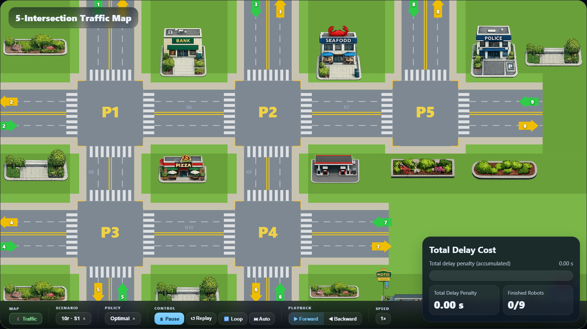
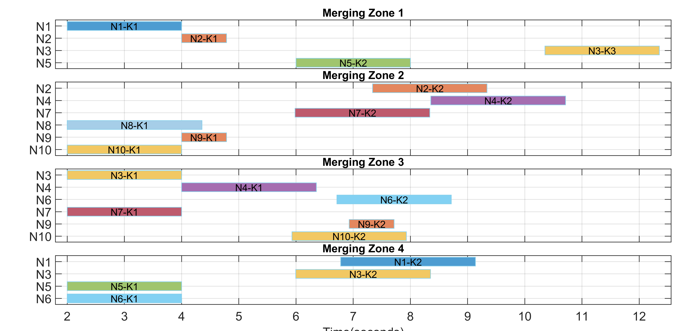

# Distributed Scheduling for Multi-Intersection Robot Traffic

MATLAB and Python implementations of distributed C-ADMM scheduling for
multi-intersection robot traffic, together with a browser-based visualization
demo and representative experiment outputs.

Given robot routes, the scheduler determines conflict-free crossing sequences
and arrival/departure times across multiple intersections.

## Multi-intersection overview

The interactive demo provides a top-down view of the five-intersection traffic
network used to visualize scheduled vehicle movements.



## Representative schedule

The figure below shows a representative multi-intersection schedule generated
by the distributed MATLAB implementation.



## Repository layout

- `matlab/` — MATLAB implementation, including the distributed C-ADMM
  scheduler, decision-tree scheduling code, four-intersection and
  five-intersection cases, and representative batch results.
- `python/` — Python implementation of the distributed C-ADMM scheduler,
  including runnable examples, topology construction, and validation.
- `traffic-demo/` — interactive HTML/JavaScript visualization with the saved
  schedule examples used by the demo.

## MATLAB entry points

- `MAIN_Sequential_Debug.m` — sequential version for breakpoints and debugging;
  it does not require parallel execution.
- `MAIN_Parallel_Compute.m` — four-intersection distributed scheduler. Set
  `useParallel = false` to run it sequentially.
- `MAIN_limited_worker.m` — parallel version with a limited worker count.
- `five_intersection/MAIN_Parallel_5int.m` — five-intersection distributed
  scheduler; the default example runs sequentially without Parallel Computing
  Toolbox.

To view the browser demo on Windows, run
`traffic-demo/start_demo.bat`.

## MATLAB requirements

- MATLAB
- YALMIP on the MATLAB path
- Gurobi configured as the YALMIP solver
- Parallel Computing Toolbox only when an entry point is explicitly run with
  `useParallel = true`; the default public examples run sequentially

Verify the solver setup in MATLAB with `which sdpvar -all` and
`which gurobi -all`.

## Portable paths

MATLAB scripts resolve data and output locations from their own file locations,
not from the current MATLAB working directory or a user-specific absolute path.
The shared helper is
`matlab/renke_project_paths.m`:

```matlab
thisFile = mfilename('fullpath');
thisDir = fileparts(thisFile);
repoRoot = fileparts(thisDir);

paths.batchDir = fullfile(thisDir, 'BatchRuns');
paths.demoDir = fullfile(repoRoot, 'traffic-demo', 'schedules');
```

Checkpoints are saved in the relevant `BatchRuns/<case>/` directory, so running
a script from a different folder does not redirect or lose its outputs.

`BatchRuns` retains MATLAB result files and PNG examples needed to reproduce
the visualization workflow. Redundant MATLAB `.fig` copies are not tracked when
an equivalent PNG is available.

## Python entry points

- `python/main.py` — direct runnable distributed scheduling example.
- `python/run_validation.py` — four-intersection validation against the saved
  reference configuration.
- `python/run_mpc_demo.py` — receding-horizon scheduling example.

Install the Python dependencies and run from the repository root:

```powershell
pip install -r python/requirements.txt
python python/main.py
```

The restored Python directory contains only the scheduler and the files needed
to run or validate it. Presentation generators/documents and generated
experiment artifacts are not included.
